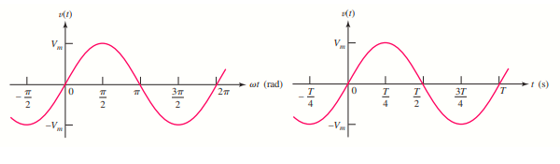
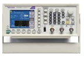
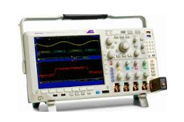
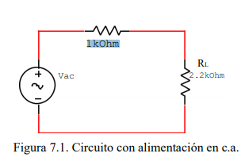
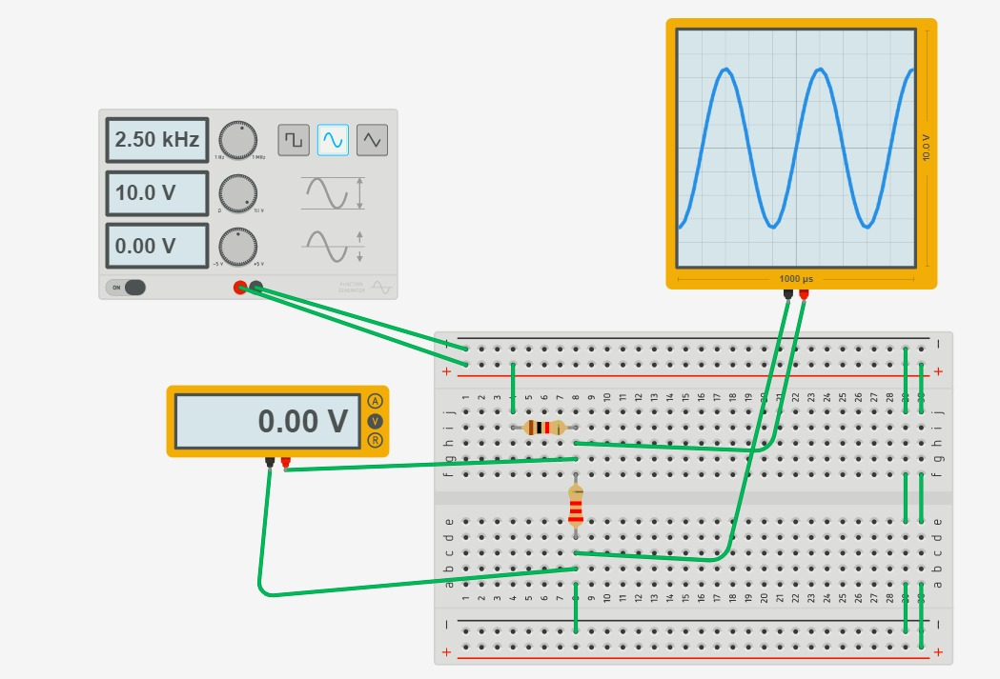
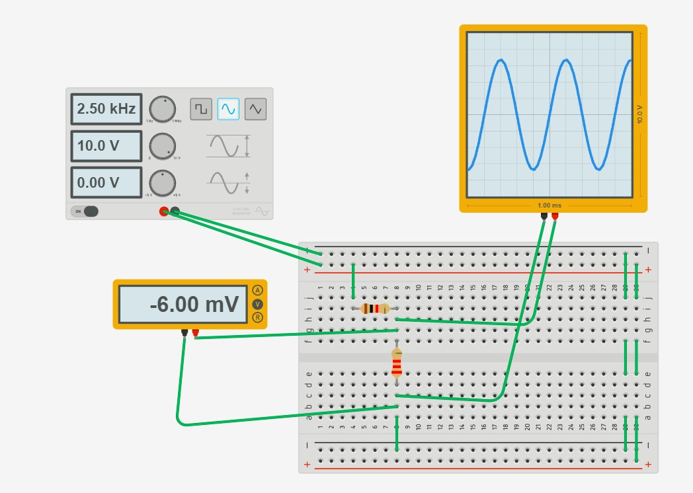
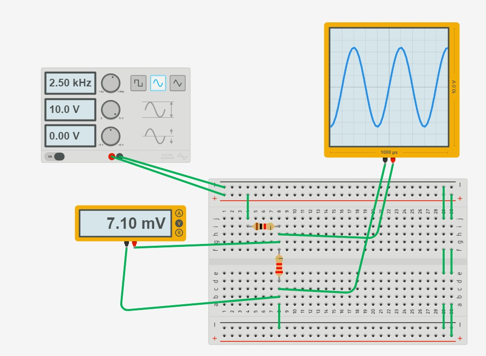
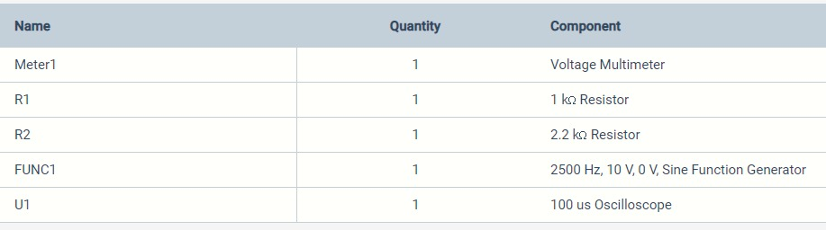

# Informe-7
## OBJETIVOS

Determinar experimentalmente las características de señales senoidales.

**Objetivos específicos:** 
 - Conocer los controles de un osciloscopio digital para usarlos de manera adecuada en la obtención de medidas de: amplitud, voltaje y frecuencia en circuitos alimentados con corriente alterna senoidal.
 - Identificar los elementos principales de la onda de voltaje.   
 - Aprender a utilizar el equipo eléctrico de medición de C.A.
## MARCO TEÓRICO

La onda senoidal es el tipo más común de señal alterna. El servicio de energía provistopor las compañías que generan electricidad está en forma senoidal. Las siguiente figuramuestra una señal senoidal.Como se puede notar una señal senoidal alterna entre valores positivos y negativos. Si unvoltaje senoidal es aplicado a un circuito resistivo, resulta una corriente senoidal. Cuandoel voltaje cambia de polaridad, la corriente cambia de dirección

La onda sinusoidal se puede simplificar a solo una ecuación de onde están todos los datos necesarios para poder entenderla y conseguir un gráfico, la formula en cuestión es:
v(t) = Vm sen ωt
	En esta fórmula vemos que nos dan el voltaje en función de varias componentes, Vm se lo toma como la amplitud de la función y la parte de ωt es el argumento y solo ω es la frecuencia angular y como se puede ver que es una función seno es decir que tiene un periodo de 2π.

<section>
      

                   
   

   </section>
   
Con todo esto podemos encontrar una ecuacion que relaciona la frecuencia [hz] con la frecuencia [rads/s] donde:
f = 1 /T    ,   ω T=2π    ,  ω =2πf

## **DESCRIPCIÓN DE LOS EQUIPOS Y MATERIALES**

**Generador de onda** 
<section>
      

                   
   

   </section>
   
**Multímetro digital**. Nos ayudara para poder hacer las mediciones de la practica
</section>
      

                   
   

   </section>

**Resistores** de 1kΩ, 2.2kΩ. Los utilizaremos para crear el circuito que vamos a medir
</section>
      

                   
   

   </section>

**Protoboard.** Es la base en la cual se va a formar el circuito con los elementos de este.
</section>
      

                   
   

   </section>

**Osiloscopio.** 
</section>
      

                   
   

   </section>

## **PROCEDIMIENTO**

Arme el circuito que se muestra en la figura.
</section>
      

                   
   

   </section>

7.5.2.. Ajuste el generador de funciones, para que proporcione una señal de 20 Vpp a
una frecuencia de 2.5 Khz.
7.5.3. Conecte el osciloscopio al resistor de carga RL. Observe la señal que aparece en
el osciloscopio.

7.5.4. Responda las siguientes preguntas:

¿Cuántas divisiones por cuadro abarca la amplitud pico de la señal de salida?

3,25.

¿En qué valor está posicionada la perilla VOLTS/DIV? 

La perilla de arriba del todo.

¿Cuántas divisiones por cuadro abarca un ciclo completo de la señal de salida?

6,5.

¿En qué valor está posicionada la perilla TIME/DIV?

La perilla de la mitad.

7.5.5.¿Cuál es la amplitud de voltaje y el periodo de la señal que aparece en la pantalla
del osciloscopio?

Amplitud de voltaje: 10 (V)

Periodo: 4 * 10^(-4) (s)

7.5.6. Determine la frecuencia natural (Hz) y la frecuencia angular (rad/s) de la señal de
salida.

f: 2.5kHz

ω:  5000π rads/s (rad/s)

7.5.7. Con el multímetro digital mida el voltaje de salida en RL: 

El multímetro mide varios valores, porque es corriente alterna.

7.5.8. Compare el voltaje medido en el punto 7.5.5. y el obtenido en el punto 7.5.7.

¿Coinciden?

No coinciden

¿Por qué? 

El multímetro mide varios valores, porque es corriente alterna.

## **DIAGRAMAS**
<section>
      

                   
   

   </section>
   
   </section>
      

                   
   

   </section>
				  
   <section>
      

                   
   

   </section>                                  
                                  
   
## **LISTA DE COMPONENTES**

 </section>
      

                   
   

   </section>

## **CONCLUSIONES**

Con esta práctica se pudo adquirir los conocimientos teóricos de lo que son las ondas sinusoidal, de acuerdo al circuito montado.

En conclusion, se lograron los objetivos de la practica, los cuales eran, realizar un estudio del comportamiento de los circuitos electricos con corriente alterna, demostrando la onda senideal que este circuito genera, de las cuales logramos medir y calcular la amplitud, tension eficaz, periodo y la frecuencia de la onda, para el circuito realizado.

## **RECOMENDACIONES**

Se establecen en función del proyecto y constituyen la base para un funcionamiento adecuado.

No se debe sobrepasar los limites de voltaje y frecuencia ya que no vamos a poder visualizar las formas de onda y lo unico que veremos en el osciloscopio es ruido.

## **CRONOGRAMA**

 </section>
      

                   
   

   </section>
  

  

# **BIBLIOGRÁFICA**

William H. Hayt, J., Kemmerly, J. E., & Durbin, S. M. (2012). Análisis de circuitos en ingenieria. Buffalo: Mc Graw Hill.
Vásquez, J. R. G. (s. f.). TEOREMAS FUNDAMENTALES DE CIRCUITOS ELÉCTRICOS. 251.

_Imagen_. (s.f.). Recuperado el 2 de 6 de 2020, de Wikipedia, la enciclopedia libre: http://commons.wikimedia.org/wiki/File:Gustav_Robert_Kirchhoff.jpg

_Imagen_. (s.f.). Recuperado el 2 de 6 de 2020, de Wikipedia, la enciclopedia libre: http://commons.wikimedia.org/wiki/File:KCL_-_Kirchhoff's_circuit_laws.svg

_Imagen_. (s.f.). Recuperado el 2 de 6 de 2020, de Wikipedia, la enciclopedia libre: http://commons.wikimedia.org/wiki/File:Kirshhoff-example.svg

Ricárdez, A., Bastién Montoya, M., Hernández, B., & H. S., R. S. (2017). Estrategias para Resolver Problemas de Introducción a la Electrostática y Magnetostática. Ciudad de Mexico.

